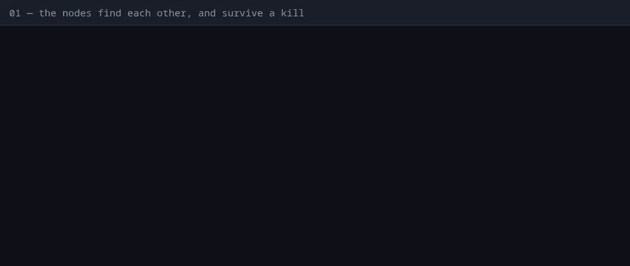
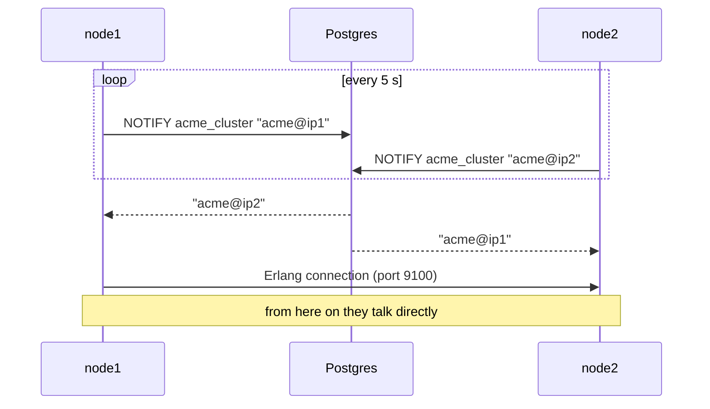

# 01 — The nodes find each other, and survive a kill

**Claim.** Start three copies of the same release and they join into one
cluster through Postgres alone — no Consul, no DNS, no extra service. A node
killed without warning drops out, the load balancer keeps answering, and the
node rejoins when it comes back.

**Library code:** `Dandelion.Cluster`, `Dandelion.Cluster.Postgres`.

**What the log shows** ([`run.log`](run.log), one line per check, with the time
it happened):

- each node lists the other two;
- a broadcast on one node reaches a subscriber on another;
- six requests through nginx return 200;
- `node2` is killed with `SIGKILL`; `node1` then sees one other node, and six
  more requests still return 200;
- `node2` is started again and both sides see each other.

**Not shown:** real VMs, or a network that silently drops packets (see
[LIMITS](../LIMITS.md)). The database outage is [claim 07](../07-database-outage/).

**Re-run:** `evidence/record.sh proof`
