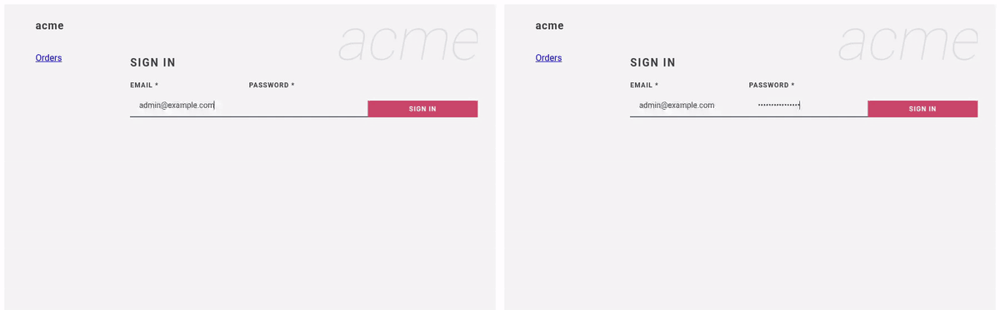

# 02 — An order made on one node shows live in a browser on another

**Claim.** A message sent on one node reaches browsers connected to any other
node, and "who's online" counts every connection across the cluster. No Redis,
no socket server to run.

**Library code:** none of it is in the library on purpose — it is
`Phoenix.PubSub` plus a channel in the example app, running on the cluster from
[claim 01](../01-cluster/). This is the evidence that the cluster carries it.

The page says which node each browser is connected to (*connected to
acme@…*). The recorder retries until the two browsers are on **different**
nodes, then:

1. both pages show **2 online now**;
2. an order is created in **A**; it appears in **B** within a second;
3. an order is created in **B**; it appears in **A**;
4. **B** closes; **A** drops to **1 online now**.

[`run.log`](run.log) names the two nodes and each step.
Stills: [`browser-a.png`](browser-a.png), [`browser-b.png`](browser-b.png).

**Not shown:** many thousands of connections, or behaviour during a network
split (presence merges when it heals; see [LIMITS](../LIMITS.md)).

**Re-run:** `evidence/record.sh live`
