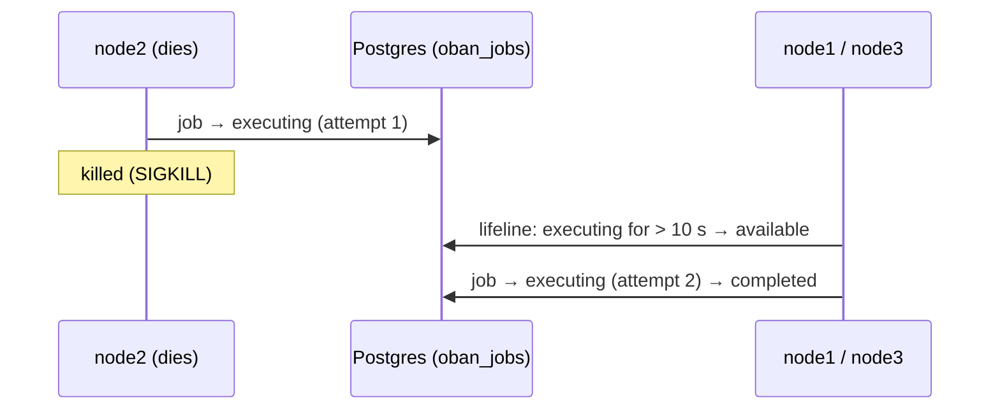

# 03 — A job left by a killed node is run again by another node

**Claim.** A background job belongs to the cluster, not to a node. If the node
running it dies, another node runs it again; a job that is queued runs once.

**Library code:** `Dandelion.Queue` (the lifeline setting), on Oban.

**What the log shows** ([`run.log`](run.log)):

- creating an order queues its confirmation job; it completes in **1 attempt**,
  on one node;
- a job row is left `executing` by a node that is then killed; ten seconds
  later another node gives it back and it completes on its **2nd attempt**.

**An honest detail.** No job in the example runs long enough to catch one
mid-flight, so the proof **writes the `executing` row by hand**, then kills the
node. It proves the cluster gives such a job back and runs it; it does not
prove the exact moment of a crash. The recovery time is `rescue_after`: 10 s in
the proof, 5 minutes by default.

**Negative control:** with the rescue time set to a day, the proof fails at the
ordered-queue step that depends on it
([`controls/lifeline.log`](../controls/lifeline.log)).

**Re-run:** `evidence/record.sh proof` (control: `evidence/record.sh controls`)
