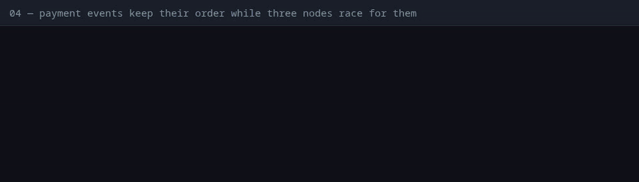
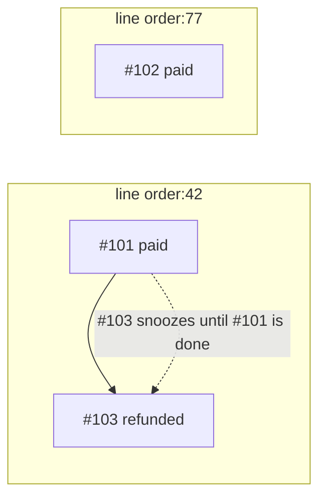

# 04 — Events of one order keep their order, while three nodes race for them

**Claim.** Each `order.created` subscriber runs once per order. Payment events
for one order run in the order they arrived even when three nodes compete for
the jobs; other orders are not held back; a dead node's unfinished event holds
back only its own order, until it is given back.

**Library code:** `Dandelion.Queue.Ordered`, `Dandelion.PubSub`.

**What the log shows** ([`run.log`](run.log)):

- both subscribers of `order.created` completed, once each;
- the webhook refuses a request without the token (401);
- ten orders each get *payment, then refund*, sent in that order while the
  queue is held, then released to all three nodes. A refund that ran before
  its payment would be dropped (a pending order can't be refunded), so ten
  orders ending `refunded` means the order was kept;
- a job stuck on a "dead node" blocks only its own order; another order is
  paid meanwhile; after the rescue, the held order's refund runs after it.

**Negative control — this is the important one.** With the order check
disabled, the same proof **fails**: some order ends `paid`, not `refunded`
([`controls/ordering.log`](../controls/ordering.log)). The proof can tell.

**Not shown:** the order of events sent by *different* servers at nearly the
same instant: order means arrival at Postgres, not the senders' clocks.

**Re-run:** `evidence/record.sh proof` (control: `evidence/record.sh controls`)
