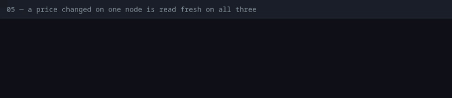
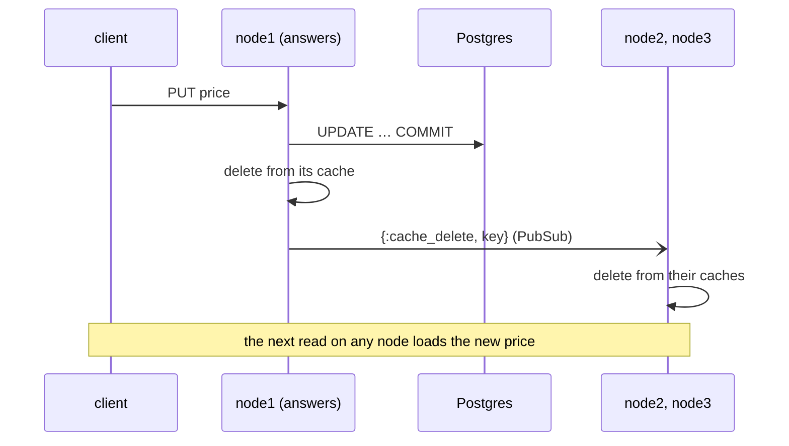

# 05 — A price changed on one node is read fresh on all three

**Claim.** Every node keeps its own copy of a cached value (a read costs no
network trip), and a delete through any node clears it on all of them. A node
that loses a node and gets it back starts with an empty cache.

**Library code:** `Dandelion.Cache`, `Dandelion.Cache.Listener`.

**What the log shows** ([`run.log`](run.log)):

- a product is read on all three nodes; each keeps its own copy;
- the price is changed through nginx (whichever node answers); every node then
  reads the new price;
- `node1` drops a node and gets it back: its cache was emptied.

**Negative control:** with the broadcast removed, the proof **fails** at the
price check: two nodes still read the old price
([`controls/cache.log`](../controls/cache.log)).

**Not shown:** a network split (halves may drift for up to the 60 s TTL, then
converge; see [LIMITS](../LIMITS.md)).

**Re-run:** `evidence/record.sh proof` (control: `evidence/record.sh controls`)
