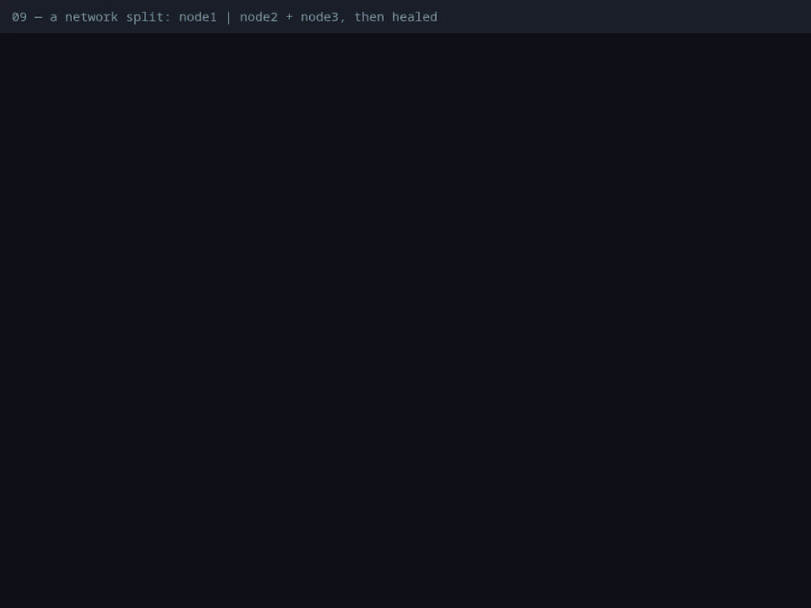
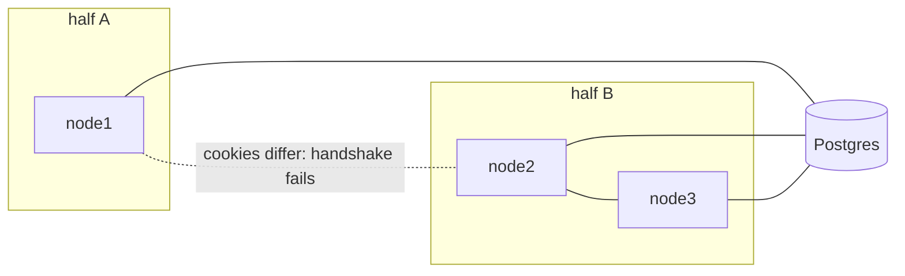

# 09 — A network split: what each half can do, and what happens on the heal

**Claim.** When the cluster splits into two halves that can't see each other —
but can both still reach Postgres — nothing that must be right goes wrong:
jobs, events and ordered payments still run exactly once, there is still one
cron leader, and the pieces that live in memory (broadcasts, caches, presence)
behave the way DESIGN §10.3 says: they are lost or briefly stale during the
split, and put themselves right when the halves meet again.

**Library code:** `Dandelion.Cache` (the rejoin clear), `Dandelion.Queue`,
`Dandelion.Queue.Ordered`, `Dandelion.PubSub`, `Dandelion.Cluster`.

**How the split is made** (no privileges, no firewall rules): `node1` is given
a wrong Erlang cookie for `node2` and `node3`, and those two a *different*
wrong cookie for `node1`, then each side drops the connection. libcluster keeps
trying to reconnect, and keeps failing the handshake. The heal puts the right
cookie back. All three nodes keep their Postgres connection throughout.

**What the log shows** ([`run.log`](run.log), with times):

| During the split | Because |
|---|---|
| a live broadcast on `node1` does **not** reach `node2` | fire and forget, like Redis pub/sub: it is lost across a split |
| a price changed on node2's side is read at once on node2 and node3; the cut-off `node1` still serves the **old** price | a cache is per node; the delete couldn't reach it |
| 10 orders made on **both** sides produce 20 subscriber jobs, each completed **once** | the jobs live in Postgres, which both halves reach |
| exactly **one** cron leader | Oban's leader is a row in Postgres |
| a payment sent on node1's side and its refund on node2's side run in that order | the order check asks Postgres |
| each half sees only its own viewers (node1 1, node2 2, node3 2) | presence is memory, merged between connected nodes |

| After the heal | Because |
|---|---|
| the halves find each other again (seconds) | libcluster reconnects when the cookies match |
| `node1`'s cache is **emptied** — an entry cached just before the heal, not an expired one, is gone — and it reads the current price | `Dandelion.Cache.Listener` clears on `:nodeup` |
| presence is merged: every node sees all 3 viewers again | Phoenix.Presence is a CRDT; it converges |
| still exactly one cron leader; each payment event completed once | Postgres decided, throughout |

**Negative control:** with the clear-on-rejoin removed, the proof **fails** at
"node1's cache was emptied when it rejoined"
([`controls/rejoin.log`](../controls/rejoin.log)).

**Not shown:** a split that also cuts a half off from Postgres (a half without
the database can't run jobs or hold the leader, by construction, but that is
not reproduced here), an asymmetric split (A sees B but B can't see A), or a
very long split (past the 60 s cache TTL the stale entry would simply expire;
the proof keeps the check independent of that). See [LIMITS](../LIMITS.md).

**Re-run:** `evidence/record.sh partition` (control: `evidence/record.sh controls`)
