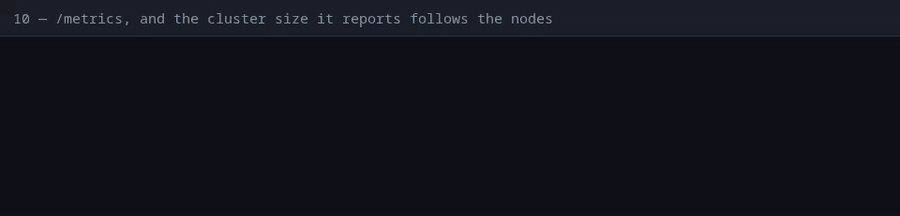

# 10 — `/metrics`, and the cluster size it reports follows the nodes

**Claim.** Every node serves its own Prometheus metrics at `GET /metrics`:
requests, handlers, database, background jobs, the cache's hits and misses, and
the number of nodes it is connected to. That last number is a live gauge: it
drops when a node is killed and comes back when it rejoins, so it can be alerted
on.

**Code:** `Platform.Web.Telemetry` and `Platform.Web.MetricsHandler` in the
example (the metric list is in one function; the reporter is
`telemetry_metrics_prometheus_core`), and `Dandelion.Cache`, which emits
`[:dandelion, :cache, :fetch]` for the hit/miss counter.

**What the log shows** ([`run.log`](run.log), with times):

- `GET /metrics` through nginx returns 200 and Prometheus text with the request
  histogram;
- every node reports `platform_cluster_nodes_count 3`;
- `node3` is killed with `SIGKILL`: `node1`'s metric drops to **2**;
- `node3` comes back: `node1`'s metric is **3** again.

The gauge is refreshed every 10 s by a poller, so the proof allows up to 30 s
for each change — a monitoring system would see it within one scrape or two.

**Not shown:** a running Prometheus or Grafana (the proof reads the endpoint and
the numbers, not a dashboard); the `METRICS_TOKEN` option (it has unit tests in
the example, not a cluster check); metric values under load.

**Re-run:** `evidence/record.sh proof`
