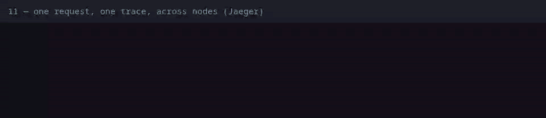
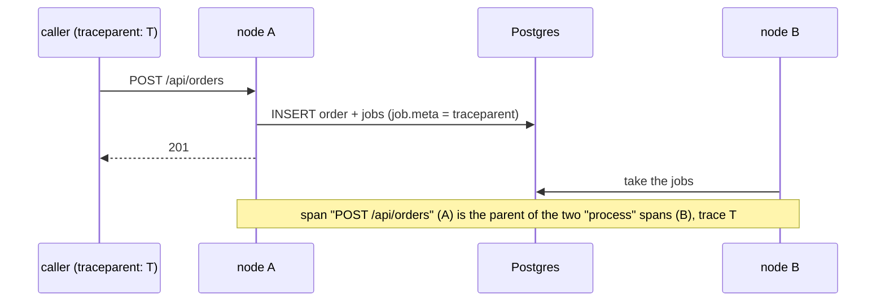
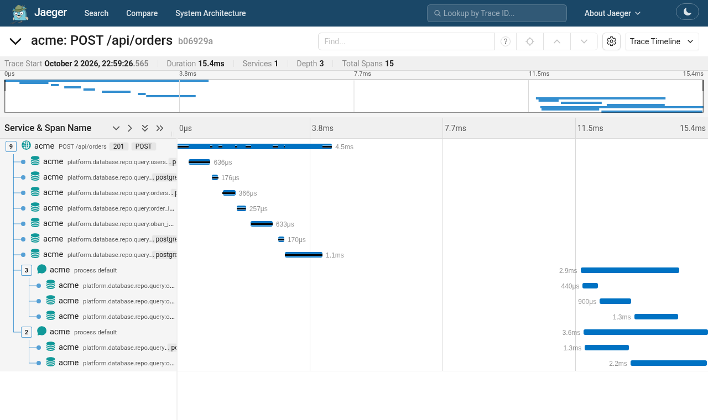

# 11 — One request, one trace, across nodes

**Claim.** A request is a trace, and the work it causes — its database queries
and the background jobs it queues — belongs to the same trace, even when the
job runs on a different node. A trace id sent by the caller is kept.

**Code:** the example's tracing setup (`Platform.Application`,
`config/runtime.exs`, `rel/env.sh.eex`), and in the library
`Dandelion.PubSub` and `Dandelion.Queue.Ordered`, which store the trace context
in the job (`Dandelion.Trace`).

**What the log shows** ([`run.log`](run.log), with times):

- `GET /health` sent with our own `traceparent` is, a few seconds later, that
  trace in Jaeger (queried over Jaeger's API), made on the node that took it;
- an order sent the same way: the trace has database spans for the order
  (`…repo.query:orders`);
- **one trace, two nodes:** the request on one node and the order's two jobs
  (the confirmation and the customer stats) on another. The proof makes up to ten
  orders until a job lands on a different node than the request — usually the
  first one does.

What it looks like in Jaeger's UI (an order's trace, found through Jaeger's own
search; [`browser/jaeger-ui.mjs`](../browser/jaeger-ui.mjs) takes it, after a warm-up,
from a trace whose jobs ran on another node than the request):

**Not shown:** a backend other than Jaeger (spans are standard OTLP, so Tempo or
Honeycomb should do, but this isn't tested); sampling (every span is kept; the
README says to sample in production); the ordered queue's trace propagation
(unit-tested in the library, not in the cluster proof).

**Re-run:** `evidence/record.sh proof` (needs python3 for reading Jaeger's JSON).
