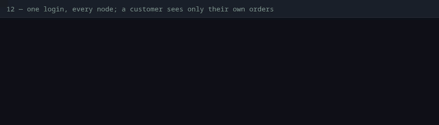

# 12 — One login, every node; a customer sees only their own orders

**Claim.** A login is a signed token that every node accepts (no session to
share); routes need it; a customer sees and cancels only their own orders and
gets a 404 for anyone else's; prices are for admins; a tampered token and a
WebSocket without a token are refused.

**Code:** the example's `accounts` domain and the router's pipelines (not in the
library: auth is the app's). The cluster is what makes the first claim worth
checking.

**What the log shows** ([`run.log`](run.log), with times):

- an order without a login: **401**;
- one login, then nine requests spread over the nodes by nginx (which says which
  one answered): **all three nodes** accept the same token;
- a customer reads and cancels their own order, gets **404** for an admin's
  (the same as for an id that doesn't exist), and their list holds only theirs;
  the admin sees both;
- a customer changing a price: **403**;
- a token with one character added: **401**;
- the WebSocket: **403** without a token or with a bad one, **101** with a good one.

**Not shown:** that a token expires (unit-tested: an expired, forged and
other-purpose token are each 401), password hashing strength (a unit test checks
the format and the verification, not that 600 000 iterations is enough for you),
brute-force protection (there is none: rate limiting is the load balancer's
job), and that a stolen token is good until it expires (there is no revocation).

**Re-run:** `evidence/record.sh proof`
