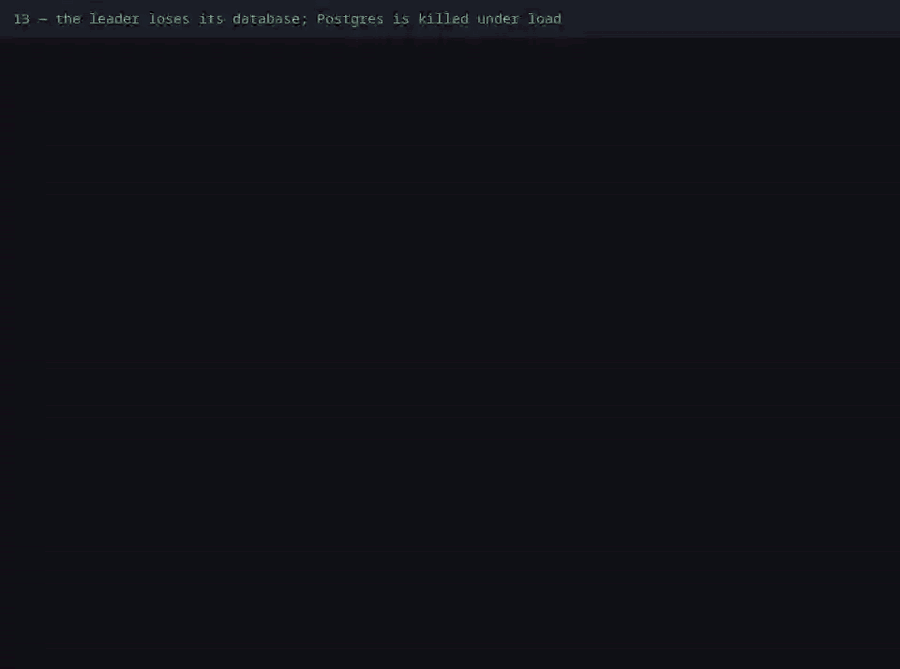

# 13 — The leader loses its database; Postgres is killed under load

**Claim.** The database going wrong in two harder ways doesn't break what the
cluster promises:

1. **The leader is cut off from Postgres** — only the leader, and not from the
   cluster. It stops running jobs and steps down; another node takes over as the
   only leader; the rest carry on; its cache serves until the entries expire, and
   not a second longer; when its database comes back it is whole again.
2. **Postgres goes away under load** — killed, stopped cleanly, or frozen — while
   three clients make orders through the load balancer. Every order that was
   answered 201 is still there afterwards, and **every order has both its events —
   never an order without them, never an event twice** — and no node restarted.

**Code:** nothing new in the library; this is Oban's leader election, the
`Dandelion.Cache` expiry, and `Dandelion.PubSub.publish/3` inside the order's
transaction (which is what makes the last claim true).

**How the cut is made.** Postgres sits on its own Docker network (`db`) and the
nodes are on it and on `default`, where they find each other. Cutting one node
off is `docker network disconnect`: no privileges, no firewall rules. The nodes are
named after their address on `default` (`NODE_HOST`), so the cut node is still
reachable by the others.

**What the log shows** ([`run.log`](run.log), with times):

| Leader cut off | Because |
|---|---|
| the leader can't reach Postgres, the others can; all three still see each other | the networks are separate |
| it still serves a cached price | `Dandelion.Cache`, from memory |
| 6 orders made on the other nodes: all 12 subscriber jobs completed once, **none on the cut node** | the cut node can't claim jobs |
| it steps down, and another node becomes the only leader (**37 to 53 s** after the cut in the runs, **never two at once**, sampled throughout) | Oban's lease in Postgres expires |
| 70 s on, its cached price is gone and it **can't answer** | a cache doesn't replace the database |
| after the reconnect it reaches Postgres at once, there is still one leader, it sees all the orders, and takes jobs again | Postgrex reconnects by itself |

**Postgres goes away under load, three ways** — killed (SIGKILL, a crash), stopped
cleanly, and **frozen** (the process is paused: connections stay open and nothing
answers, which is what a hung or overloaded database looks like). Three clients make
orders through the load balancer the whole time. The same promises each time:

| After each outage | Because |
|---|---|
| a few hundred orders were answered 201 (251, 280 and 282 in the recorded run) and some failed during the outage | the outage was real |
| **every acknowledged order is in the database** afterwards | Postgres's write-ahead log |
| every order in the database has exactly **two completed subscriber jobs**, none discarded | the order and its events are one transaction |
| no node restarted, 3 nodes, `/health` 200, **exactly one cron leader again** | the pool and the cluster reconnect |

**While the database is frozen**, the proof also checks what a client and a load
balancer would see: `/health` answers **503** in a few seconds (3.8 s in the recorded
run — a request has to give up on its stuck connection) and the API answers **503**,
not a 500 and not a request that hangs. Both were found by this test, not assumed:
the first `/health` during a freeze used to hang for 32 seconds, and a hung database
was a 500.

**Negative control** ([`controls/dualwrite.log`](../controls/dualwrite.log)): with the
events saved *after* the order's transaction (with a long gap, so a crash always
falls into it) the same proof **fails**: orders exist without their events. That is
the dual-write problem the project avoids by publishing inside the transaction.

**Not shown:** an outage of minutes (the longest is about 25 s), a cut that drops only
some connections, a leader cut off from *the cluster* but not
from Postgres (that is claim 09), an asymmetric split, or a database that is
slow and not gone.

**Re-run:** `evidence/record.sh failures` (control: `evidence/record.sh controls`)
